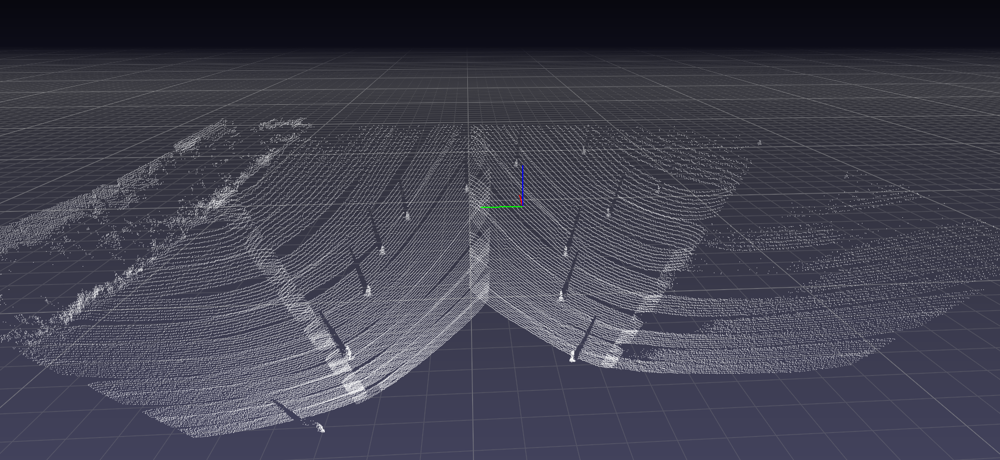
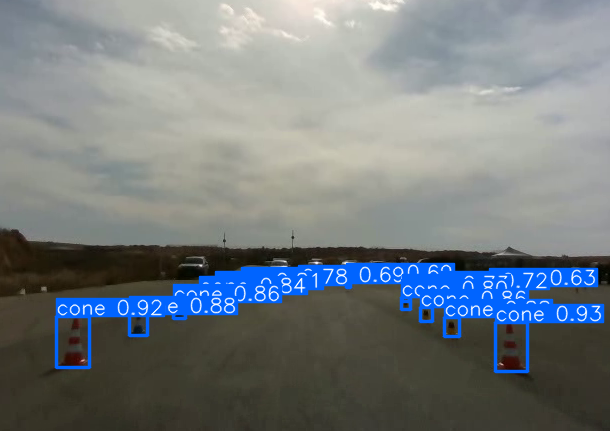
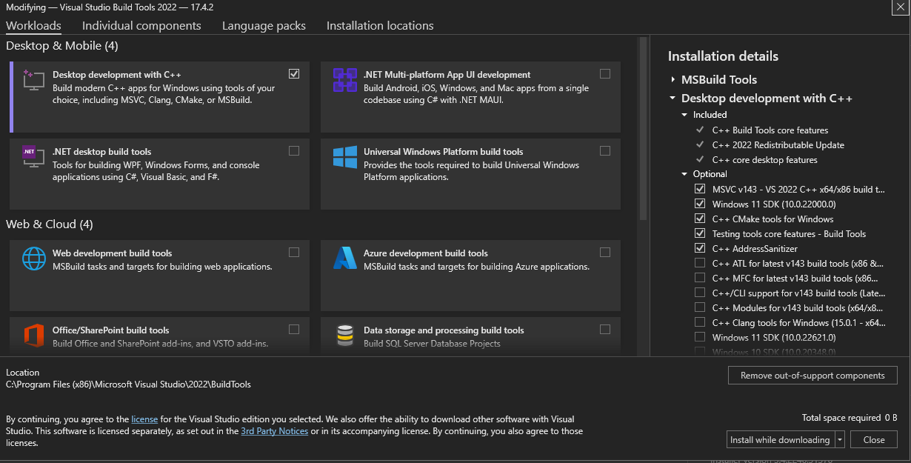
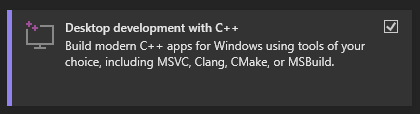

<h1 align="center"> Perception-Mapping </h1>
<p align="center">
 
</p>

## Installations:
**Important**: If you want to use the <u>camera </u> or the <u>mapping projects only</u>, skip the lidar software installations.

### 1. Fork and clone the project
first fork the project using the fork button in the repository ```https://github.com/BGU-Racing/BGR-PM```


``` 
git clone https://github.com/{YOUR_GITHUB_USER}/BGR-PM
cd BGR-PM
```  
 
### 2. Create & activate the Anaconda environment 
* Install anaconda from [here](https://www.anaconda.com) and add it to <b> windows variables path</b>.
```
conda create -n pm_project python=3.6
conda activate pm_project 
```

### 3. Install Innoviz`s lidar software requirements (skip this part if you want camera/mapping projects only)
* Install <a href=" https://visualstudio.microsoft.com/visual-cpp-build-tools/ ">visual-cpp-build-tools</a>.
<br>
In this window, select the following options:



<br>
and install it.
<br>
* Install npcap
  * Download and install the latest npcap release from https://nmap.org/download.html
  * If you have WinPcap installed, permit npcap to uninstall WinPcap.

### 4. Install the python requirements (after activating the conda environment)
# SUPER IMPORTANT
* Lidar Team:

  If you are part of the lidar team and you want to add new feature or code please create a new feature-branch from the Lidar branch.

  ```
  git checkout -b <your_branch_name_feature> origin/Lidar
  ```

* Camera Team:

  If you are part of the Camera team and you want to add new feature or code please create a new feature-branch from the Camera branch.
  ```
  git checkout -b <your_branch_name_feature> origin/Camera
  ```

<b> When you finish your feature and you want to merge it to the Camera/Lidar branches please speak with our devops and the team leader. </b>


## Install the requirements


* <b><u> For the complete Perception-Mapping project:</u></b>
  * Install the requirements:
  ```
  pip3 install -r requirements.txt
  cd Sensors/Lidar
  python -m pip install tools/InnovizAPI/python
  cd ../../
  ```

  * Run the code: -- NOT RELEVANT AT THE MOMENT --
  ```
  python ut/pm_ut.py
  ```

* <b> For camera only: </b>
  
  * Install the requirements:
    ```
    cd Sensors/Camera
    pip3 install -r requirements.txt
    ```
  * Run the code:
  
    * Please refer to the Camera [README](Sensors/Camera/README.md).

* <b> For lidar only: </b>
  
  * Install the requirements and the Innoviz API python module
  ```
  cd Sensors/Lidar
  pip3 install -r requirements.txt
  python -m pip install tools/InnovizAPI/python
  ```
  * Run the code
  
     * Please refer to the Lidar [README](Sensors/Lidar/README.md).


  

* <b> For mapping only: </b> --NOT RELEVANT AT THE MOMENT--

  * Install the requirements:
    ```
    cd Mapping
    pip3 install -r requirements.txt
    ```
  * Run the code:
    ```
    python ut/mappingUT.py
    ```
    


